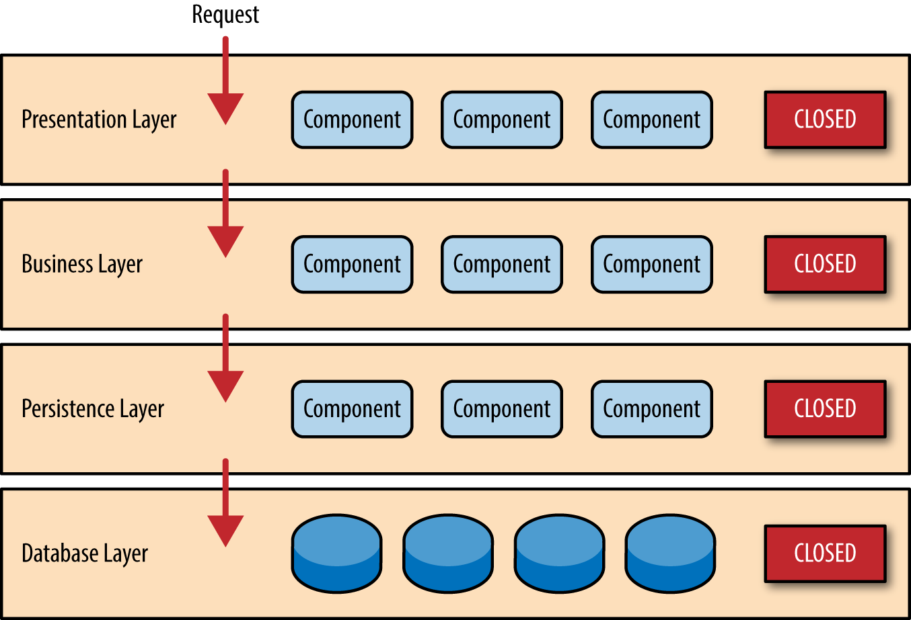
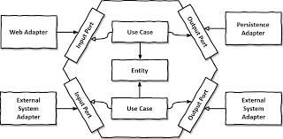
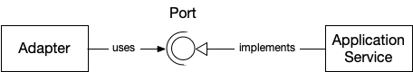
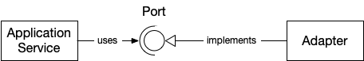
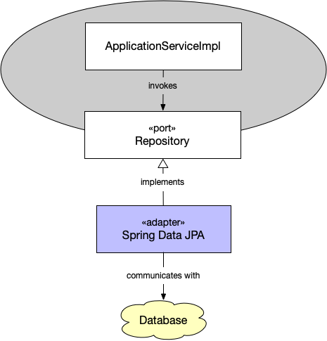

# Prijedlog arhitekture za Spring Boot aplikacije 

## Heksagonalna arhitektura


Termin heksagonalna arhitektura u upotrebi je vec neko vrijeme, a kao alternativni izrazi, s posve istim znacenjem, spominje se i "ports and adapters" arhitektura.

Postoje i mnoge varijacije te arhitekture koje pokusavaju prilagoditi osnovne principe potrebama stvarnoga, industrijskoga razvoja koda.

U ovom tekstu pokusat cu na pocetku opisati sto heksagonalna arhitektura uopce jest, zasto je valja razmotriti, te naposljetku dati prijedlog arhitekture i rasporeda paketa, a zatim pokusati pronaci slucajeve kada valja razmisliti o upotrebi heksagonalne arhitekture.

## Zasto ne slojevita?

Vecina sirokorasprostranjenoga koda u vecini domacih tvrtki dogmatski je naslonjena na tradicionalnu slojevitu arhitekturu.

Slojevita arhitektura u enterprise java aplikacijama postoji odvajkada, ona je intuitivna, s minimalnim "viskom" nepotrebnoga koda i ljepila, a opet omogucuje logicku razdiobu koda i donekle smanju entropiju koda.



Medjutim, slojevita arhitektura, iako naoko jednostavna i logicna, ima svoje mana. One se najbolje ocituju kad proizvod koji razvijamo pocne bujati i tada se troslojna arhitektura iz softverskoga inzenjerstva pretvara u gradjevinski rad i zbukanje. Svaka nova funkcionalnost novi je problem.

### Nije problem, imam 10000 klasa u dao sloju i lijepo mi je!

Jedan od glavnih problema slojevite arhitekture jest to sto je ona najcesce podijeljena upravo na nekoliko uobicajenih paketa. U gotovo svakom projektu naici cemo, u razlicitim imenovnim doskocicama, na pakete "dto", "dao", "repository", "domain", "model", "service", "core"...
U jednini i mnozini i u raznim kombinacijama, ali u biti jednako.

Zamislite da pocnete graditi aplikaciju za jednostavnu elektronicku trgovinu koja ce na kraju postati eBay. U pocetku mozete pretpostaviti samo ono sto znadete, a to je da zelite jednostavnu trgovinu i to je posve u redu. Medjutim, kako potrebe budu rasle, projekt ce u jednom trenutku puknuti i to ne iz razloga sto ce biti apsolutno tesko citljiv i sto ce biti nemoguce navigirati po bespucima klasa. Programeri se tome uvijek dovinu, makar bilo jednostavno lose i tesko.

Problem ce biti u skaliranju. U jednom trenutku cete shvatiti da je obrada narudzbi kriticna i da je potrebno osigurati nisku latenciju i visoku dostupnost, dok je za reklame to nevazno.

Pokusat cete raditi sto i dosad - skalirati monolit. Jos jedan worker, jos  jedna VM u regiji i to ce doseci plafon i postati skupo, ruzno i naprosto nemoguce.

Sljedeci korak jest pokusati to nekako izdvojiti u nekoliko servisa pa skalirati one bitne. Napraviti medjusobnu komunikaciju, bilo asinkronu preko reda poruka, bilo sinkornu preko starih dobrih REST upita. Medjutim, tu ce vas docekati problem iz naslova - 10000 klasa u paketu.

### Treba mi NoSql

Drugi problem koji se, premda zapravo rijedak u praksi, u kompleksinijim projektima gdje se cesto nailazi na uska grla i performansne probleme ipak moze dogoditi jest to da se odluci da umjesto dohvata iz relacijske baze zelimo spremati neke podatke u key-value store, primjerice.
Medjutim, zelimo ostaviti korisnicima mogucnost da koriste i relacijsku bazu, ovisno o zastavici u application.yaml.

U slojevitoj arhitekturi taj potez sastojat ce se od nekoliko koraka:

1. Napravi novi model jer je stari vezan za JPA i anotiraj ga s pripadajucim anotacijama
2. Napravi novi repozitorij jer je stari zapravo nadklasa JpaRepositoryja
3. Promijeni u servisnom sloju konstruktor i dodaj clansku varijablu
4. Napravi mapper
5. Dodaj hrpu if varijabli koje ce provjeravati sto smo odabrali i u skladu s time pozivati metodu iz odgovarajucega repozitorija.

Kaos.

### Zasto da slojevita?

Jer je aplikacija koju radimo jednostavna, ima mozda 15-ak tablica i jednu domenu ili je uopce nema strogo definiranu, radimo CRUD i validaciju i nemamo kompleksan domenski model.

Kad znamo da radimo sicu, treba prestati razmisljati i jednostavno napraviti dto, repository, service i model i rijesili smo problem (los pokusaj rime).

## Heksagonalna? Sto? Zasto?

Heksagonalna arhitektura zauzima jedan drugi stav pri dizajnu aplikacije, a to je da je u sredistu aplikacije domena, tj. (kompleksna) poslovna logika koju pokusavamo pretociti u aplikaciju. Sve ostalo - spremiste podataka, kontroleri, routeri, consumeri, prezentacija podataka, klijenti, to se sve naslanja na domenu i treba zapravo zadovoljavati potrebe domene, tj. neki nacrt koji je definiran u domeni. Dakle glavna razlika izmedju troslojne arhitekture i heksagonalne jest u tome da nemamo tranzitivnu ovisnost, dakle sloj koji ovisi o sloju ispod njega, nego sve ovisi o domeni.

Zamislite domenu kao puzlu koja ima ulazne i izlazne spojke i na koju se nabadaju ostale puzle.



### Kada razmisliti o heksagonalnoj?

Vrlo jednostavno, onda kad pocnete dobivati dojam da aplikacija ima kompleksnu domenu, da poslovna pravila postaju nesto o cemu treba razmisljati mnogo vise nego sto potrosite vremena na replikaciju obicno kotnrolera.

Ne postoji zlatno pravilo, ali kad imate nekoliko many-to-many relacija, kada podatci prolaze kroz vise faza i imate ociti pipeline ili kad postaje jasno da ce dijelove aplikacije trebati skalirati u buducnosti i izdvajati u zasebne mikroservise, tada valja razmisliti o heksagonalnoj arhitekturi.


### DDD


### Heksagonalna u Spring Bootu i raspored paketa

#### Opci pregled

Osnovna ideja heksagonalne arhitekture, kako je receno vec u prvom dijelu, jest da sve popratne stvari ovise o domeni.

Sto to znaci u praksi?

To znaci da cemo u sredistu imati domenu. U spring boot aplikaciju to ce u praksi biti ili paket ili zaseban maven modul koji ce se zvati domain. Hoce li to biti paket ili modul ovisi o aplikaciji i vasim konkretnim potrebama.

Zatim cemo imati boundary. Unutar boundaryja imat cemo kontrolere, routere, consumere za redove poruka...

I naposljetku infrastrucure. U infrastructure nalazit ce se storage, pristup cloud servisima, implementacije klijenata...

```
├── boundary
│   └── order
│       ├── OrderHttpHandler
│       ├── OrderResponse
│       ├── OrderStatusConsumer
│       └── PlaceOrderReqest
├── domain
│   └── order
│       ├── Order
│       ├── OrderItem
│       ├── OrderService
│       ├── OrderStatus
│       ├── ShippingDetails
│       ├── command
│       │   ├── AddOrderCommand
│       │   └── PlaceOrderCommand
│       ├── discount
│       │   ├── DiscountProcessor
│       │   ├── LoyaltyDiscountProcessor
│       │   ├── LoyaltyDiscountStrategy
│       │   └── MultiDiscountProcessor
│       └── port
│           ├── api
│           │   ├── ManageOrder
│           │   └── PlaceOrder
│           └── spi
│               ├── GetInventory
│               └── OrderRepository
└── infrastructure
    └── persistence
        └── order
            ├── JpaOrder
            ├── JpaOrderItem
            ├── JpaOrderRepository
            └── adapter
                └── JpaOrderRepositoryAdapter
```

#### Domain

Srce vase aplikacije. Ono sto klijent od vas trazi i ono sto mu mozete i trebate objasnjavati. Klijenta ne zanima Kafka, WebFlux, Postgres, zanimaju ga poslovna pravila.

Kod modeliranja domene uvijek je bitno pokusati da stvari budu modularne, dobro imenovane, prosirive, da poslovna pravila budu izdvojezna u zasebne klase, da budu lako promjenjiva. 
Ovdje cete upotrebljavati obrasce koji vam se cine naravnima - strategije, chain of responsabiliy, memento, fasade, command, decorator...

Domena za pocetak ima domenski objekt, taj domenski objekt mora biti potpuno apstrahiran od bilo kakve ORM biblioteke. U osnovi radi se o agregatnom korijenu u DDD terminologiji koji zatim obuhvaca niz entiteta (to nisu entityji iz JPA! sami po sebi) i value objekata. Kao sto je vec receno u DDD poglavlju entiteti su mutable klase, value objekti su immutable, cesto cemo graditi preko buildera i anotirati s @Value anotacijom iz Lomboka ili cemo koristiti record ako se radi o javi 17+.

Kao sto je receno u DDD poglavlju, domenski objekti moraju biti bogati! Koristimo OOP i sasvim je naravno da domenski objekti imaju staticke ili clanske metode koje ih mijenjaju, izracunavaju nesto, odradjuju neku logiku, koristite OOP principe kod dizjna, entiteti nisu lista atributa nego objekti.

Nekad, medjutim, nije moguce svu logiku implementirati unutar domenskoga objekta. Nekad ce nam trebati vise objekata u kombinnacji koje cemo morati dohvatiti iz repozitorija, tada kreiramo servise. Mi cemo ih nastaviti nazivati servisi, radi se zapravo o fasadama. Servisi/fasade implementirat ce port. Radi se o api portu i sad je pravi trenutak raspraviti o razlici izmedju api i spi portova.

##### API i SPI

Kao sto smo i rekli. Sve se u heksagonalnoj arhitekturi "kopca" na domenu. Medjutim, storage dio aplikacije prirodno ne ovisi o domeni, zar ne, zapitat cete se. Tako je, zato u troslojnoj arhitekturi imamo tranzitivnu ovisnost. U heksagonalnoj arhitekturi radimo svojevrsni obrat. Domena ce u svom paketu, kao sto je vidljivo na gornjoj slici imati paket port i u njemu pakete spi i api. Sto su oni?

Vrlo jednostavno, paket **api** definira interface za servise koji pristupaju nama - kontroler ce preko api interfacea pristupati domeni, tj. pozivati metode iz domene. Dakle, api definira nacrt metoda koje pruzamo kao domenski dio.



**Spi** (Service Provider Interface) je onaj spomenuti "obrat". U paketu spi definirat cemo interface kojima mi pristupamo kao domena. Na pr. u spi paketu definirat cemo repozitorije. To nisu JPA repozitoriji, ti repozitoriji vracaju domenske objekte, one apstrahirane od ORM-a. Dakle, najprostije receno, spi definira nas pristup prema infrastrukturnom sloju, ali mi o njemu ne ovisimo, to je iznimno bitno.

Infrstrukturni sloj definirat ce adapter prema nasem portu i to je magija koja ce se dogoditi, ali domena ce pristupati iskljucivo portu, tj. nacrtu.




Primjer domenskoga objekta:

```
@Getter
@Setter
@AllArgsConstructor
@NoArgsConstructor
public class Order {
    private String id;
    private Customer customer;
    private Instant orderDate;
    private Integer totalQuantity = 0;
    private BigDecimal total = BigDecimal.valueOf(0).setScale(2, RoundingMode.HALF_UP);
    private ShippingDetails shippingDetails;
    //in real-world scenario this should be further examined and expanded
    private OrderStatus orderStatus;
    private Set<OrderItem> orderItems = new HashSet<>();
    private Instant createdAt;
    private Instant updatedAt;

    public void addItemToOrder(final OrderItem orderItem) {
        this.orderItems.add(orderItem);
    }

    public void removeItemFromOrder(final OrderItem orderItem) {
        this.orderItems.remove(orderItem);
    }

    public Set<OrderItem> getOrderItems() {
        return Collections.unmodifiableSet(this.orderItems);
    }

    public static void applyDiscount(final Discount.DiscountType type, final BigDecimal discountPercentage, final OrderItem orderItem) {
        final BigDecimal discountAmount = orderItem.getCostPerUnit()
                                                   .multiply(discountPercentage)
                                                   .setScale(2, RoundingMode.HALF_UP);
        final Discount.DiscountBuilder builder = Discount.builder().type(type).discount(discountPercentage).discountAmount(discountAmount);
        orderItem.addToDiscounts(builder.build());

    }

    public void incrementQuantity(final Integer quantity) {
        this.totalQuantity += quantity;
    }

    public Order calculateTotal() {
        for (OrderItem item : this.getOrderItems()) {
            BigDecimal discountedCostPerUnit = item.getCostPerUnit();
            for (Discount discount : item.getDiscounts()) {
                discountedCostPerUnit = discountedCostPerUnit.subtract(discount.getDiscountAmount());
            }
            if (BigDecimal.ZERO.compareTo(discountedCostPerUnit) == 1) {
                discountedCostPerUnit = BigDecimal.ZERO;
            }
            this.total = this.total.add(discountedCostPerUnit.multiply(BigDecimal.valueOf(item.getQuantity())));
        }
        return this;
    }

    public Order cleanDiscount() {
        for (OrderItem orderItem : this.orderItems) {
            orderItem.clearDiscounts();
        }
        return this;
    }
}
```

Primjer servisa/fasade:

```

@RequiredArgsConstructor
@Slf4j
public class OrderService implements PlaceOrder, ManageOrder {

    private final OrderRepository orderRepository;

    private final OrderEventPublisher orderEventPublisher;

    private final GetInventory getInventory;
	
    private final DiscountProcessor discountProcessor;

    private final BookServiceMapper bookServiceMapper;

    @Override
    public Mono<Order> handle(@Valid final PlaceOrderCommand command) {
        //in real-world scenario we would check if this order belongs to the customer to prevent fraudulent behaviour
        log.info("Placing order with command: {}", command);
        final Mono<Order> order = this.orderRepository.findById(command.orderId())
                                                    .switchIfEmpty(Mono.error(new IllegalArgumentException("Order does not exist")));

        return order.map(o -> {
            //TODO: find a way to deal with duplicates
//            o.getOrderItems().stream().map(i -> this.getInventory.findByBookId(i.getBook().getBookId()).filter(res -> res.quantity() < i.getQuantity()))
            final ShippingDetails.ShippingDetailsBuilder shippingDetailsBuilder = ShippingDetails.builder();

            o.setShippingDetails(fillShippingDetails(command, shippingDetailsBuilder));

            o.setOrderStatus(OrderStatus.FINISHED);

            return o;
        }).flatMap(this.orderRepository::save).doOnSuccess(o -> {
            final Map<String, Integer> bookStockUpdate = o.getOrderItems()
                                                          .stream()
                                                          .collect(Collectors.toMap(i -> i.getBook()
                                                                                          .getBookId(), OrderItem::getQuantity));

            this.orderEventPublisher.emitNotification(o.getId(), o.getCustomer().getCustomerId(), bookStockUpdate);
        });
    }

    private static ShippingDetails fillShippingDetails(final PlaceOrderCommand command,
                                                       final ShippingDetails.ShippingDetailsBuilder shippingDetailsBuilder) {
        return shippingDetailsBuilder.address(command.address())
                                     .country(command.country())
                                     .county(command.county())
                                     .postalCode(command.postalCode()).build();
    }

    @Override
    public Mono<Order> handle(@Valid final CreateOrderCommand command) {

        final Order order = new Order();
        order.setOrderStatus(OrderStatus.CREATED);
        order.setTotalQuantity(0);
        //emulating customer, should be pulled from external source (separate microservice)
        order.setCustomer(new Customer(command.customerId(), command.name()));
        return this.orderRepository.save(order)
                                 .doOnNext(o -> log.info("Creating order with id={}", o.getId()));
    }

    @Override
    public Mono<Order> handle(@Valid final AddItemToOrderCommand command) {
        final Mono<Order> order = this.OrderRepository.findById(command.orderId())
                                                    .switchIfEmpty(Mono.error(new IllegalArgumentException("Order does not exist")))
                                                    .handle((o, sink) -> {
                                                        if (o.getOrderStatus() == OrderStatus.CREATED) {
                                                            sink.next(o);
                                                        } else {
                                                            sink.error(new IllegalStateException("Order must not be already placed"));
                                                        }
                                                    });

        //check if book is on stock and available
        final Mono<Book> book = this.getInventory.findByBookId(command.bookId())
                                                 .switchIfEmpty(Mono.error(new IllegalArgumentException("Book does not exist")))
                                                 .filter(bookResponse -> bookResponse.stock() >= command.quantity())
                                                 .switchIfEmpty(Mono.error(new OutOfStockException()))
                                                 .map(bookResponse -> this.bookServiceMapper.toBook(bookResponse));

        final Mono<Order> combinedOrder = order.zipWith(book, (o, b) -> {
            o.getOrderItems().stream().filter(i -> i.getBook().getBookId().equals(b.getBookId()))
             .findFirst()
             .ifPresentOrElse(i -> i.incrementQuantity(command.quantity()), () -> {
                 final OrderItem orderItem = OrderItem.builder().book(b)
                                                      .quantity(command.quantity())
                                                      .costPerUnit(b.getBasePrice())
                                                      .build();

                 o.addItemToOrder(orderItem);
                 o.incrementQuantity(orderItem.getQuantity());
             });
            return o;
        });

        return this.discountProcessor.process(combinedOrder.map(Order::cleanDiscount))
                                     .map(Order::calculateTotal)
                                     .flatMap(this.OrderRepository::save)
                                     .doOnSuccess(o -> {
                                         final Map<String, Object> payloadMap = new HashMap<>();

                                         final Map<String, Integer> stockUpdateMap = new HashMap<>();
                                         payloadMap.put("customerId", o.getCustomer().getCustomerId());

                                         o.getOrderItems()
                                          .forEach(i -> stockUpdateMap.put(i.getBook().getBookId(), i.getQuantity()));
                                         payloadMap.put("stockUpdate", stockUpdateMap);
                                     });
    }


    @Override
    public Mono<Order> getOrder(final String orderId) {
        return this.orderRepository.findById(orderId);
    }

    @Override
    public Flux<Order> getOrders() {
        return this.orderRepository.findAll();
    }
}

```

Osim navedenih dijelova i djelica domene, imat cemo naravno i command paket s naredbama za servise/fasade, validatore, exceptione, sve sto je vezano za domenu.

#### Boundary

Najlaksi nacin da odredimo hoce li nesto ici u boundary jest taj da vidimo da li ta nasa klasa zapravo "konzumira" domenu, tj. sadrzaj domene. Dakle, kontroler ce ocito konzumirati domenu, consumer takodjer, SOAP WS takodjer, sve to ce ici u boundary.

Medjutim, mi necemo direktno ukljucivati servise, fasade ili domenske klase, nego cemo imati portove.

Primjer:

```
@Component
@RequiredArgsConstructor
public class OrderHttpHandler {

    private final PlaceOrder placeOrder;
    private final ManageOrder manageOrder;

    private final OrderApplicationMapper orderApplicationMapper;
    private final BasicValidator basicValidator;

    public Mono<ServerResponse> createOrder(final ServerRequest serverRequest) {
        return serverRequest.bodyToMono(CreateOrderRequest.class)
                            .map(this.basicValidator::validate)
                            .map(this.orderApplicationMapper::toCreateOrderCommand)
                            .flatMap(this.manageOrder::handle)
                            .flatMap(order -> created(URI.create("/api/v1/orders/" + order.getId())).build());
    }

    public Mono<ServerResponse> addItemToOrder(final ServerRequest serverRequest) {
        final String id = serverRequest.pathVariable("id");

        return serverRequest.bodyToMono(AddItemToOrderRequest.class)
                            .map(this.basicValidator::validate)
                            .map(req -> new AddItemToOrderCommand(id, req.bookId(), req.quantity()))
                            .flatMap(this.manageOrder::handle)
                            .flatMap(order -> ok().build());
    }

    public Mono<ServerResponse> placeOrder(final ServerRequest serverRequest) {
        final String id = serverRequest.pathVariable("id");

        return serverRequest.bodyToMono(PlaceOrderRequest.class)
                            .map(this.basicValidator::validate)
                            .map(i -> this.orderApplicationMapper.toPlaceOrderCommand(i, id))
                            .flatMap(this.placeOrder::handle)
                            .flatMap(order -> ok().build());
    }

    public Mono<ServerResponse> all(ServerRequest serverRequest) {
        return ok().body(this.getOrder.getOrders(), Order.class);
    }

    public Mono<ServerResponse> get(ServerRequest serverRequest) {
        final String id = serverRequest.pathVariable("id");
        return ok().body(this.getOrder.getOrder(id), Order.class);
    }

    public Mono<ServerResponse> delete(ServerRequest serverRequest) {
        return null;
    }
}

```


U gornjem primjeru vidimo dva porta portova: PlaceOrder i ManageOrder

Portove, kao sto je navedeno u gornjem potpoglavlju o domeni, sami granuliramo. Dakle, hoce li port biti funkcionalni interface ili imati vise operacija ovisi o vasim dizjnerskim odlukama, kao i to kako ce se zvati. Autor ovoga teksa preporucio bi da grupirate po logickim cjelinama i da ih nazovete Operations. Dakle, ako imate Order kao domenu i ako tu narudzbu mozete administrirati, kao administrator, ako mozete narucivati, kao korisnik mrezne trgovine, imalo bi smisla imati dva porta - ManageOrder i PlaceOrder, koje se cine smislene cjeline.
To nije tako jednostavno, ali nije ni priblizno najtezi dio heksagonalne arhitekture.

Paket boundary valjalo bi podijeliti po nacelu package-by-feature, pa cete u ./boundary/order imati, primjerice, OrderController, OrderInfo (dto), PlaceOrderRequest(dto) OrderConsumer, OrderBoundaryMapper...

#### Infrastructure

Zapravo, sve ono sto ostaje. Sve sto osjecate da bi mogao biti library. Na pr. kreiranje PDF dokuementa, sva implementacija u infrastructure, logging, persistence - svi Jpa repozitoriji, svi Jpa entiteti, kafka produceri, sve implementacije klijenata koji su kroz port definirani u domeni...

Ono sto je bitno uociti da ovdje imenovanje paketa ide /infrastructure/{persistence, messaging, logging}/ime_domene

Osim toga, u infrastructure dijelu, imat cemo adaptere koji ce implementirati spi portove iz domene i "prilagodjavati" nase libraryje/persistence, bilo sto u objekte definirane ugovorm tj. portom u domeni.

Da pokusamo biti maksimalno plasticni. Ako zelite generirati PDF i imate neki skup klasa koji se upotrebljava u vise domena. Implementacija tog PDF generatora, nalazit ce se u ./infrastructure/pdf/...

Medjutim, nacrt metoda koje cemo pozivati unutar domene bit ce definiran u portu, neki model koji cemo koristiti u domeni, bit ce definiran u domeni, ali taj port, bit ce implementiran u ./infrastructure/pdf/... kroz neki servis/klijent/fasadu. Dakle, bitno je positvari osnovni "ugovor" koji propisuje heksagonalna arhitektura - sve ovisi o domeni, domena ne ovisi ni o cemu (direktno).



